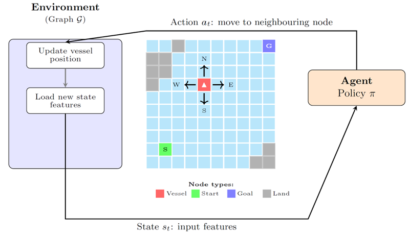

# Shipping Route Predictor

Route prediction for cargo vessels. XGBoost models are trained with behavior cloning on AIS shipping routes and Copernicus weather data. Refactored implementation of the master thesis "AI-based Prediction of Long-distance Vessel Trajectories with AIS and Copernicus Data" — N. Takacs, Technical University of Denmark (DTU).

<p align="center">
  
</p>
<p align="center"><i>Example: Busan → Manzanillo route prediction with weather-aware XGBoost (CISC) and per-step SHAP feature importance.</i></p>

<p align="center">
  
</p>
<p align="center"><i>Agent - environment interaction: the agent navigates ocean grid cells, predicting the next action at each step until the goal port is reached.</i></p>

## Quick start

```bash
# Clone and install (Python ≥ 3.12)
cd shipping_route_predictor
pip install -e .

# Predict a route (Shanghai → Los Angeles, coarse grid)
python -m shipping_route_predictor.inference

# Predict with SHAP explainability
python -m shipping_route_predictor.inference --shap

# Custom ports
python -m shipping_route_predictor.inference \
    --start_port USLAX --goal_port KRPUS
```

## Installation

The package requires **Python 3.12+** and installs from the project root:

```bash
pip install -e .
```

## CLI reference

### Inference

Predict a single route and save results (JSONs + route map):

```bash
# Default: Shanghai → Los Angeles, coarse grid, simple_greedy + shortest_path
python -m shipping_route_predictor.inference

# Custom ports
python -m shipping_route_predictor.inference \
    --start_port USLAX --goal_port KRPUS

# Custom lat/lon
python -m shipping_route_predictor.inference \
    --start_lat 1.3 --start_lon 103.8 \
    --goal_lat 55.0 --goal_lon 12.5

# CISC model + SHAP
python -m shipping_route_predictor.inference \
    --model_types simple_greedy simple_cisc shortest_path \
    --shap

# Shell wrapper
bash bash_scripts/inference.sh --grid coarse --models "simple_greedy simple_cisc"
```

| Argument            | Default                         | Description                            |
|---------------------|---------------------------------|----------------------------------------|
| `--grid`            | `coarse`                        | Grid resolution: `coarse` (32×64) or `fine` (128×256) |
| `--model_types`     | `simple_greedy shortest_path`   | Space-separated list of models to run  |
| `--start_port`      | `CNSHA` (Shanghai)              | Start port LOCODE or name              |
| `--goal_port`       | `USLAX` (Los Angeles)           | Goal port LOCODE or name               |
| `--start_lat/lon`   | —                               | Override start port with coordinates   |
| `--goal_lat/lon`    | —                               | Override goal port with coordinates    |
| `--start_time`      | from trajectory config          | Departure time (ISO 8601)              |
| `--vessel_loa`      | 399.0                           | Vessel length overall (metres)         |
| `--speed_knots`     | 14.5                            | Vessel speed for ETA estimation        |
| `--shap`            | off                             | Run SHAP explainability after inference|
| `--output_dir`      | `results/inference_results/<route>_<grid>_<timestamp>` | Where to save results |
| `--no_visualize`    | off                             | Skip route visualization               |

Inference outputs are saved to `results/inference_results/`:

- `<model>.json` — predicted route per model (one file each, e.g. `simple_greedy.json`, `shortest_path.json`)
- `summary.json` — run metadata (ports, grid, timing)
- `route_map.png` — visualization of all predicted routes

### SHAP explainability

When `--shap` is passed, the system runs `shap.TreeExplainer` on the XGBoost model along the
predicted route. Outputs are saved to `results/shap_results/`:

- `feature_importance.csv` — features ranked by mean |SHAP value|
- `category_importance.csv` — SHAP values aggregated by feature category
- `shap_route_timeline.png` — visualization of predicted route with per-step SHAP contributions by category
- `feature_names.json` — ordered feature name list
- `step_shap.json` — raw per-step SHAP values

## Models

The vessel navigates a **graph environment** derived from a discretized ocean grid (see figure above):

- **Nodes** correspond to navigable ocean grid cells; land cells are masked, navigable latitude range is $[-60°, +70°]$.
- **Edges** connect neighbouring navigable cells; edge length corresponds to geodesic distance (decreasing with latitude).
- **Training** — the policy is learned via behavior cloning on historical AIS vessel trajectories.
- **Roll-out** — at inference the agent repeatedly predicts the next action and the environment updates the vessel position until the goal is reached.

Each model is defined by three axes: **grid resolution**, **feature set**, and **rollout strategy**.

**Grid resolution:** `fine` (128×256) gives ~1° cells, `coarse` (32×64) gives ~5° cells.
Select with `--grid fine` or `--grid coarse`.

**Feature set:** `simple` uses position, goal direction, depth, and neighbourhood features (14 dimensions).
`full` extends the simple features with time-varying Copernicus Marine weather variables (wind, waves, currents) sampled at the current cell, 8 neighboring locations, and 6 previous vessel locations.

**Rollout strategy:** *Greedy* picks the highest-probability action at each step.
*CISC* (Confidence-Informed Stochastic Control) runs multiple stochastic rollouts and selects the most promising action.

| Model name          | Grid      | Features | Rollout  | Availability |
|---------------------|-----------|----------|----------|--------------|
| `simple_greedy`     | coarse    | simple   | Greedy   | public       |
| `simple_cisc`       | coarse    | simple   | CISC     | public       |
| `full_greedy`       | coarse    | full     | Greedy   | private (requires Copernicus weather data) |
| `full_cisc`         | coarse    | full     | CISC     | private (requires Copernicus weather data) |
| `simple_greedy`     | fine      | simple   | Greedy   | private (exceeded git size limit) |
| `simple_cisc`       | fine      | simple   | CISC     | private (exceeded git size limit) |
| `full_greedy`       | fine      | full     | Greedy   | private (requires Copernicus weather data, exceeded git size limit) |
| `full_cisc`         | fine      | full     | CISC     | private (requires Copernicus weather data, exceeded git size limit) |
| `shortest_path`     | any       | —        | —        | public       |
| `company_baseline`  | any       | —        | —        | private (privately owned) |

## Project layout

```
shipping_route_predictor/
├── pyproject.toml          # Package metadata and dependencies
├── src/                    # Source files
│   ├── config.py           # Default configurations for inference, SHAP explainability analysis, evaluation, CISC tuning and training
│   ├── inference.py        # Single-route CLI inference
│   ├── rollout.py          # Greedy and CISC roll-out implementations for XGBoost models
│   ├── env.py              # Environment graph: maintains vessel position, supplies inputs for XGBoost models
│   ├── data.py             # Dataset loaders for AIS, Copernicus and Ocean depth data
│   ├── baselines.py        # Shortest-path and company baseline models
│   ├── visualize.py        # Visualization for inference and SHAP: Cartopy route maps + SHAP visualisations
│   ├── explainability_shap.py  # SHAP explanabiltiy analysis
│   ├── utils.py            # Metrics: Haversine, Fréchet, time estimation, I/O
│   ├── train.py            # Behavior cloning training code for XGBoost (private — needs AIS data)
│   ├── eval.py             # Evaluation of the selected models on the same trajectories (private — needs AIS data)
│   └── tune_cisc.py        # CISC tuning - parameter grid search (private — needs AIS data)
├── bash_scripts/           # Shell wrappers (train, eval, inference)
├── models_pretrained/      # Pretrained XGBoost checkpoints
├── data/                   # Grid CSVs (mask, lat, lon, depth), ports, vessel metadata
└── results/                # Inference outputs, eval CSVs, SHAP results
```

## Private components

Training, evaluation, and CISC tuning are not runnable with the public repository alone:
- **Data availability** — AIS trajectory data and Copernicus Marine weather data are proprietary / licensed and not included. All the above components cannot work without AIS data.
- **Company baseline** — relies on a privately owned routing package. Therefore, evaluation against the company baseline is not possible in the public repository.


Changes to inferece due to private components:
- **Vessel metadata** — AIS data is private, so per-vessel information (LOA, operator) from AIS records is not included. During inference, all vessels use fleet-median defaults (LOA = 184.8 m, operator = "other"). This should have negligable impact, as the 2 attributes together only accounted for ~0.1% of XGBoost feature importance gain during training.
- **Pretrained full models are not included** — Copernicus data is not included as it is private. Full models cannot work without Copernicus data, therefore, pretrained full models are not included.
- **Model size** — fine-grid and full models exceed the 100 MB git file-size limit and are not committed. Therefore, only the coarse simple XGBoost model is included in the repository.


The remaining part of this document provides a reference to those with access to the private components.
Install private dependencies:

```bash
pip install -e ".[private]"
```

### Training

Train an XGBoost behaviour-cloning model from trajectory data:

```bash
python -m shipping_route_predictor.train --grid fine --model_type simple
python -m shipping_route_predictor.train --grid coarse --model_type full
python -m shipping_route_predictor.train --grid fine --model_type simple --wandb_mode online
bash bash_scripts/train.sh fine simple online
```

| Argument        | Default    | Description                                      |
|-----------------|------------|--------------------------------------------------|
| `--grid`        | `fine`     | Grid resolution: `fine` or `coarse`              |
| `--model_type`  | `simple`   | Feature set: `simple` or `full`                  |
| `--wandb_mode`  | `disabled` | W&B logging: `disabled`, `online`, `offline`, `dryrun` |

### CISC tuning

Tune CISC rollout parameters (temperature *T*, alpha *α*, beta *β*, number of rollouts *N*) on a validation set:

```bash
python -m shipping_route_predictor.tune_cisc --grid fine --model_type simple
python -m shipping_route_predictor.tune_cisc --grid coarse --model_type simple --limit 50
```

| Argument        | Default | Description                          |
|-----------------|---------|--------------------------------------|
| `--grid`        | `fine`  | Grid resolution: `fine` or `coarse`  |
| `--model_type`  | `simple`| Feature set: `simple` or `full`      |
| `--limit`       | `10`    | Max trajectories to evaluate         |
| `--output_dir`  | `results/cisc_tuning_results`    | Override output directory             |

### Evaluation

Evaluate all models and baselines over a trajectory dataset:

```bash
python -m shipping_route_predictor.eval --grid fine
python -m shipping_route_predictor.eval --grid coarse
bash bash_scripts/eval.sh coarse
```

| Argument | Default | Description                         |
|----------|---------|-------------------------------------|
| `--grid` | `fine`  | Grid resolution: `fine` or `coarse` |

