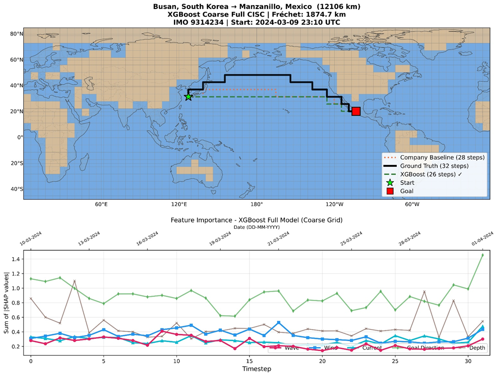

# Shipping Route Predictor

XGBoost model that predicts step-by-step vessel routes on an ocean graph from AIS data. Supports weather-aware predictions (Copernicus Marine) and SHAP explainability. From the thesis *AI-based Prediction of Long-distance Vessel Trajectories with AIS and Copernicus Data* — N. Takacs, DTU.

<p align="center">
  
</p>
<p align="center"><i>Example: Busan → Manzanillo route prediction with weather-aware XGBoost (CISC) and per-step SHAP feature importance.</i></p>

## Quick start

```bash
# Clone and install (Python ≥ 3.12)
cd xgboost_shipping_route_prediction
pip install -e .

# Predict a route (Shanghai → Los Angeles, coarse grid)
python -m shipping_route_predictor.inference

# Predict a route (Shanghai → Los Angeles, coarse grid), and assess feature importance with SHAP:
pip install -e ".[shap]"    # + SHAP explainability
python -m shipping_route_predictor.inference --shap
```

## Installation

The package requires **Python 3.12+** and installs from the project root
(`shipping_route_predictor/`):

```bash
pip install -e .            # core only
pip install -e ".[gui]"     # + Streamlit GUI
pip install -e ".[shap]"    # + SHAP explainability
pip install -e ".[all]"     # everything (gui + shap + dev)
```

## Project layout

```
shipping_route_predictor/
├── pyproject.toml          # Package metadata and dependencies
├── src/                    # Python package (import as shipping_route_predictor.*)
│   ├── __init__.py
│   ├── config.py           # All dataclass configs, port catalogue, constants
│   ├── train.py            # XGBoost trainer (behaviour cloning)
│   ├── eval.py             # Batch evaluation over trajectory datasets
│   ├── inference.py        # Single-route CLI inference
│   ├── gui.py              # Streamlit GUI (RouteGUI class)
│   ├── tune_cisc.py        # CISC parameter grid search
│   ├── rollout.py          # Greedy and CISC rollout strategies
│   ├── env.py              # EnvGraph — ocean grid + feature extraction
│   ├── data.py             # Dataset loaders (trajectories, grid CSVs)
│   ├── baselines.py        # Shortest-path and company baselines
│   ├── visualize.py        # Cartopy route maps + SHAP visualisations
│   ├── explainability_shap.py  # SHAP analysis engine
│   └── utils.py            # Haversine, Fréchet, time estimation, I/O
├── bash_scripts/           # Shell wrappers (train, eval, inference)
├── models/                 # Trained XGBoost checkpoints
├── data/                   # Trajectory JSONs, grid CSVs (mask, lat, lon, depth)
└── results/                # Inference outputs, eval CSVs, SHAP results
```

## Inference CLI

Predict a single route and save results (JSONs + route map):

```bash
# Default: Shanghai → Los Angeles, coarse grid, simple_greedy + shortest_path
python -m shipping_route_predictor.inference

# Custom ports
python -m shipping_route_predictor.inference \
    --start_port USLAX --goal_port KRPUS

# Custom lat/lon
python -m shipping_route_predictor.inference \
    --start_lat 1.3 --start_lon 103.8 \
    --goal_lat 55.0 --goal_lon 12.5

# CISC model + SHAP
python -m shipping_route_predictor.inference \
    --model_types simple_greedy simple_cisc shortest_path \
    --shap

# Or use the shell wrapper
bash bash_scripts/inference.sh --grid coarse --models "simple_greedy simple_cisc"
```

### CLI arguments

| Argument            | Default                         | Description                            |
|---------------------|---------------------------------|----------------------------------------|
| `--grid`            | `coarse`                        | Grid resolution: `coarse` (32×64) or `fine` (128×256) |
| `--model_types`     | `simple_greedy shortest_path`   | Space-separated list of models to run  |
| `--start_port`      | `CNSHA` (Shanghai)              | Start port LOCODE or name              |
| `--goal_port`       | `USLAX` (Los Angeles)           | Goal port LOCODE or name               |
| `--start_lat/lon`   | —                               | Override start port with coordinates   |
| `--goal_lat/lon`    | —                               | Override goal port with coordinates    |
| `--start_time`      | from trajectory config          | Departure time (ISO 8601)              |
| `--vessel_loa`      | 399.0                           | Vessel length overall (metres)         |
| `--speed_knots`     | 14.5                            | Vessel speed for ETA estimation        |
| `--shap`            | off                             | Run SHAP explainability after inference|
| `--output_dir`      | auto-generated                  | Where to save results                  |
| `--no_visualize`    | off                             | Skip Cartopy route map                 |

### Models

Each model is defined by three axes: **grid resolution**, **feature set**, and **rollout strategy**.

| Model name          | Grid    | Features | Rollout  | Description                                |
|---------------------|---------|----------|----------|--------------------------------------------|
| `simple_greedy`     | fine    | simple   | Greedy   | Basic features, picks highest-probability action each step |
| `simple_cisc`       | fine    | simple   | CISC     | Basic features, stochastic rollouts to pick the most promising action |
| `full_greedy`       | fine    | full     | Greedy   | Adds Copernicus Marine weather (wind, waves, currents) |
| `full_cisc`         | fine    | full     | CISC     | Weather-aware model with CISC rollouts |
| `simple_greedy`     | coarse  | simple   | Greedy   | Coarse-grid variant of the basic model |
| `simple_cisc`       | coarse  | simple   | CISC     | Coarse-grid variant with CISC rollouts |
| `full_greedy`       | coarse  | full     | Greedy   | Coarse-grid weather-aware model |
| `full_cisc`         | coarse  | full     | CISC     | Coarse-grid weather-aware with CISC rollouts |
| `shortest_path`     | either  | —        | - | Graph - Dijkstra based shortest-path baseline (no ML) |
| `company_baseline`  | either  | —        | -   | Graph with knowledge on typical shipping routes and irregular traffipax conditions - Dijkstra based (no ML)|

**Grid resolution:** `fine` (128×256) gives ~1° cells, `coarse` (32×64) gives ~5° cells.
Select with `--grid fine` or `--grid coarse`.

**Feature set:** `simple` uses position, goal direction, depth, and neighbourhood features.
`full` adds time-varying Copernicus Marine weather variables (wind, waves, currents).

**Rollout strategy:** *Greedy* picks the highest-probability action at each step.
*CISC* (Confidence-Informed Stochastic Control) runs multiple stochastic rollouts and selects the most promising action.

## SHAP explainability

When `--shap` is passed to the CLI (or the SHAP checkbox is ticked in the
GUI), the system runs `shap.TreeExplainer` on the XGBoost model along the
predicted route.  This produces:

- **Feature importance bar chart** — top-25 features by mean |SHAP value|
- **Category timeline** — stacked-area chart showing how feature categories
  (position, goal, depth, neighbourhood, …) contribute at each route step

```bash
pip install -e ".[shap]"
python -m shipping_route_predictor.inference --shap --model_types simple_greedy
```

Results are saved to `results/shap_results/`.

## Unpublished components
> **Data availability note:** The AIS trajectory data and Copernicus Marine weather data used to train and evaluate models are **not included** in this repository (they are proprietary / licensed). 
> - **Training**, **evaluation**, and **CISC tuning** require trajectory data and cannot be run out of the box.
> - **Full (weather-aware) models** require Copernicus Marine `.nc` files at inference time and will not work without them.
> - **Company baseline** is not included as it is owned by the company.
> - **Simple models** (greedy and CISC) work fully with the included pretrained checkpoints, grid data, depth maps, port catalogues, and vessel metadata.
> To use simple models, run inference as shown above — no additional data is needed.
## Training, evaluation, and tuning 

### Training

Train an XGBoost behaviour-cloning model from trajectory data:

```bash
# Simple model (no weather features) on fine grid
python -m shipping_route_predictor.train --grid fine --model_type simple

# Full model (weather features) on coarse grid
python -m shipping_route_predictor.train --grid coarse --model_type full

# With W&B logging
python -m shipping_route_predictor.train --grid fine --model_type simple --wandb_mode online

# Or use the shell wrapper
bash bash_scripts/train.sh fine simple online
```

Training reads trajectory JSONs, steps through each trajectory on the ocean
graph to extract feature–action pairs, and trains a 4-class XGBoost
classifier (actions: N, S, E, W).  Checkpoints are saved to `models/xgboost/`.

### CISC tuning

After training, tune the CISC rollout parameters (temperature *T*, alpha
*α*, beta *β*, number of rollouts *N*) to minimise Fréchet distance on a
validation set:

```bash
python -m shipping_route_predictor.tune_cisc --grid fine --model_type simple
python -m shipping_route_predictor.tune_cisc --grid coarse --model_type simple --limit 50
```

### Evaluation

Evaluate all configured models and baselines over a trajectory dataset:

```bash
python -m shipping_route_predictor.eval --grid fine
python -m shipping_route_predictor.eval --grid coarse

# Or use the shell wrapper
bash bash_scripts/eval.sh coarse
```

Produces per-trajectory CSVs, summary JSONs, a comparison table, and
histogram plots in `results/`.

## Interactive GUI - not fully tested

The Streamlit GUI provides the same functionality as the CLI with an
interactive map and point-and-click controls:

```bash
pip install -e ".[gui]"

# Launch (opens in browser)
streamlit run src/gui.py

# Custom port
streamlit run src/gui.py --server.port 8888

# Headless (e.g. on HPC)
streamlit run src/gui.py --server.headless true
```

**Features:**
- Start / goal port dropdowns or custom lat/lon input
- Grid resolution selector (fine / coarse)
- Multi-model checkboxes — run several models in one click
- Departure date/time and vessel metadata (LOA, operator, speed)
- Interactive Plotly map with all predicted routes
- Per-model result cards (distance, steps, ETA, inference time)
- Optional SHAP explainability — stacked-area timeline and feature bar chart

---

